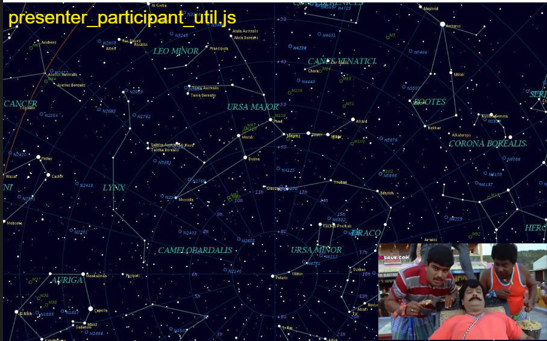
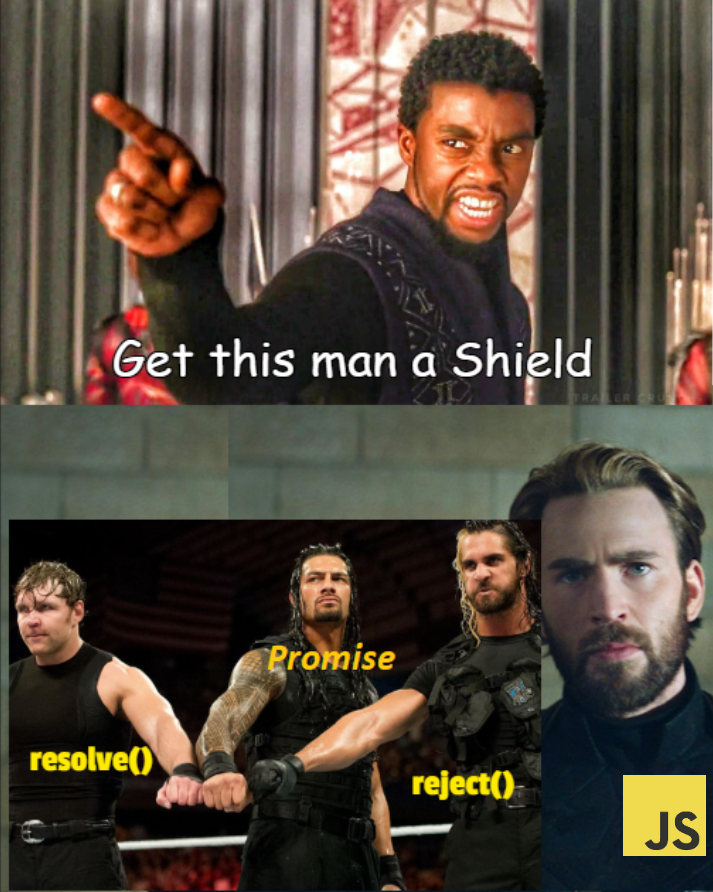

## 💠 How `event` are constantly being listened where JS is an single thread environment? <br><br>

## 💠 How `setTimeout(() => {}, 5000)` ⏳time was reduced? <br><br>

## 💠 What we need is 🧿smooth UI render for now! <br><br>


<br><br>

***
***
<br>

## [latentflip.com/loupe/🧯](https://latentflip.com/loupe/?code=JC5vbignYnV0dG9uJywgJ2NsaWNrJywgZnVuY3Rpb24gb25DbGljaygpIHsKICAgIHNldFRpbWVvdXQoZnVuY3Rpb24gdGltZXIoKSB7CiAgICAgICAgY29uc29sZS5sb2coJ1lvdSBjbGlja2VkIHRoZSBidXR0b24hJyk7ICAgIAogICAgfSwgMjAwMCk7Cn0pOwoKY29uc29sZS5sb2coIkhpISIpOwoKc2V0VGltZW91dChmdW5jdGlvbiB0aW1lb3V0KCkgewogICAgY29uc29sZS5sb2coIkNsaWNrIHRoZSBidXR0b24hIik7Cn0sIDUwMDApOwoKY29uc29sZS5sb2coIldlbGNvbWUgdG8gbG91cGUuIik7!!!PGJ1dHRvbj5DbGljayBtZSE8L2J1dHRvbj4%3D)
![alt text][notsecure]

[notsecure]: notsecure.png "ewe"

***

## YouTube 🎞️

<a href="https://youtu.be/8aGhZQkoFbQ">
  
</a>
<section>

***
***


<br><br>
<details open>
<summary>1</summary>
<h2>Javascript Runtime Environment</h2>

![alt text][JS_Engine]
</details>
</section>


<section>
<details>
<summary>image-2</summary>

![alt text][image2]
</details>

<details>
<summary>image-3</summary>

![alt text][image3]
</details>
</section>


<br>

<table style="width:100%;">
    <tr>
    <td>
    <section>
    <h2>Macro Task</h2>
        <li>setTimeout()</li>
        <li>setImmediate()</li>
        <li>setInterval()</li>
        <li>RqueueMicrotask()</li>
        <li>UI rendering</li>
        <li>I/O</li>
    </section>
    </td>
    <td>
    <section>
        <h2>Micro Task</h2>
        <li>Promise</li>
        <li>process.nextTick()</li>
        <li>queueMicrotask()</li>
    </section>
    </td>
    <tr>
<table>

***

<br>

> ### Priority

### &nbsp;&nbsp;&nbsp;&nbsp; 1. Call stack
### &nbsp;&nbsp;&nbsp;&nbsp; 2. Microtasks queue
### &nbsp;&nbsp;&nbsp;&nbsp; 3. Macrotasks queue

<br>

### The `callstack` is the first priority because it is where the current function is executed. When a function is called, it is added to the call stack, and when it is completed, it is removed from the stack.

<br>

### The `microtasks` queue is the second priority,  asynchronous tasks that are executed after the current function is completed and before any macrotasks in the queue are executed.
<br>

### The `macrotasks` queue is the last priority, and it consists of larger, asynchronous tasks that are executed after the microtasks queue is empty.

***
***

<br>
<br>

>>> #### **Callback** &nbsp;&nbsp;&nbsp;&nbsp;&nbsp;&nbsp;&nbsp;&nbsp;&nbsp;&nbsp;||&nbsp;&nbsp;&nbsp;&nbsp;&nbsp;&nbsp;&nbsp;&nbsp;&nbsp;&nbsp;**Promise**&nbsp;&nbsp;&nbsp;&nbsp;&nbsp;&nbsp;&nbsp;&nbsp;&nbsp;&nbsp;||&nbsp;&nbsp;&nbsp;&nbsp;&nbsp;&nbsp;&nbsp;&nbsp;&nbsp;&nbsp;**Async /Await**
***

<br><br>

> ## **Callback**

+ By removing the name callback, Callback is a programming way/trick as like

    <table style="width:100%">
    <tr>
    <td>
    <details open>
    <summary>callback.js</summary>

    ```Javascript
        // Callback
        function myFunction(x, y, callback) {
            var result = x + y;
            callback(result);
        }

        function myCallback(result) {
            console.log("The result is: " + result);
        }

        myFunction(1, 2, myCallback);   // Callback
    ```
    </details>
    </td>
    <td>
    <details>
    <summary></summary>

    ```Javascript
        // Recursion
        function happy(time) {
            happy(time)
        }
    ```

    <details>
    <summary></summary>
    
    </details>
    </details>
    </td>
    </tr>
    </table>


    + Just passing a reference as like variable to another function.

<br>

+  In JavaScript, a `var` can have copy of a function. 😂


    <!-- Section - 1 -->
    <section>
    <details>
    <summary>JS variable</summary>

    ![alt text][jsConsole]
    </details>
    </section>

    <!-- Section - 2 -->
    <section>
    <details>
    <summary>In C#, function should be declared with `delegate` keyword</summary>

    ```c#
    public delegate void MyCallback(int result);
    ```
    </details>
    </section>
<br>

> #### Where do we utilizing callbacks as superPower?
<br>

* When working with Browser API, callback functions can be used efficiently.

* Hard to trace.

<br>

</img>
<br><br>

<!-- Sheild Meme -->
<details>
<summary></summary>

</img>
</details>


<!-- Promise section -->
> # **Promise**
> ### ES2015 || ES6

<br>
<br>

 ## &nbsp;&nbsp;&nbsp;&nbsp;&nbsp; We need to create a `promisible` code

<br>
<br>


<table style="width:100%;">
<tr>
<td style="display:flex">
<details open>
<summary>promise.js</summary>

```c++
const myPromise = new Promise((resolve, reject) => {
  
    resolve();
    
    reject();
  
});

```
</td>

<td>
</details>

<details open>
<summary></summary>

```js
// Normal Function
function getUserMedia(){
    
    return stream;
}
```
</details>
</td>

<td>
</details>

<details>
<summary></summary>

```js
// Switch Statement
switch (day){
    case 1:
        break;
    default:
        break;
}
```
</details>
</td>
</tr>
</table>


<table width=100%>
<tr>
<td>
<details open>
<summary>callGetUserMedia.js</summary>

```js
// Create your new Promise

const callGetUserMedia = new Promise((success, failure) => {
    try{
        
        // just do your code here
        let i = 0;
        let j = 1;

        navigator.mediaDevices.getUserMedia( {audio:true, video:true} )
        .then((stream) => {
            if(stream){
                success(stream);
            }
        });
        
    }
    catch(error){
        failure(error);
    }
});


// call it
function main(){
    callGetUserMedia.then((stream) => {setJoinPageStream(stream)})
}
```

<details close>
<summary></summary>

```c++
// All the same
new Promise((resolve, reject) => { });
new Promise((success, failure) => { });
new Promise((one, two) => { });
```

</details>

<br>

</details>
</td>

<tr>

***

<br><br>

### **Do your own promise	✋**

<br>

<td  width=100%>

<br>

<details open>
<summary>callGetUserMedia.js</summary>

```js
// Pass arugments to a promise

function callGetUserMedia(constraints){

    return new Promise((resolve, reject) => 
    {
        try{
            
            // just do your code here
            let i = 0;
            let j = 1;

            navigator.mediaDevices.getUserMedia(constraints)
            .then((stream) => {
                if(stream){
                    resolve(stream);
                }
            });


        }
        catch(error){
            reject(error);
        }
    });
}
```

</td>
</details>
</td>
</tr>

</table>

<br>


### **Promise can have a Chain ⛓️**

<br>

* There might be a chained process after promise resolved.


```js
            Promise

    then()          catch()

    then()

    then()

    then()

    ...
```
* And `catch` will be always there for us.


<br>

#### callGetUserMedia.js
```c++
main(){

    // Use your promise
    callGetUserMedia.then(setJoinPageStream)
    .then(enumerateDevices)
    .then(setDevicesInLocalStorage)
    .then(startDetectingAudio)
    .catch((error) => {
        device_error_handling_revamp(error);
    })
}
```
***
***

<br>
<br>

<details>
<summary></summary>

</img>
</details>

> # **Async / Await**
> ### ES2017 || ES8

<br>

* ### To make it easier to write asynchronous code without resorting to callbacks or promises.
* ### `async/await` is a higher-level abstraction built on top of `promises`.


```js
// A async function
async function callGetUserMedia(){
    
    let result = await somethingToGet();
    return result;
}
```

```js
        async function 

            // Can have N await statements
            await
            await
            await
            await 

```
* ### handle errors more easily, using `try/catch` blocks.

<br><br>

#### callGetUserMedia.js

```js
// Create asynchronous function

async function callGetUserMedia() {

    try{
        let stream = await navigator.mediaDevices.getUserMedia(constraints);

        await enumerateDevices(stream);
        setDevicesInLocalStorage(stream);
        await startDetectingAudio(stream);
    }
    catch(error){
        throw new Error(error);
    }
}


function main(){

    // Call it as a normal function
    loadJoinPage();
    callGetUserMedia();
}
```


[Sheild_Promise]: Sheild_Promise2.png  "Sheild_Promise"

[callGetUserMedia]: callGetUserMedia_Promise.png  "image3"

[image3]: JRE_image3.avif "image3"


[image2]: https://camo.githubusercontent.com/2f12852c45cf6c9f9f7c3f03c07c063a83b7ede0/68747470733a2f2f626c6f672d6173736574732e726973696e67737461636b2e636f6d2f323031362f31302f7468652d4e6f64652d6a732d6576656e742d6c6f6f702e706e67 "sd"

[jsConsole]: Js_Variable.png "ewe"

[who-is-that-yar-adhu]: who-is-that-yar-adhu.gif "gif1"


[JS_Engine]: https://vahid.blog/post/2021-03-21-understanding-the-javascript-runtime-environment-and-dom-nodes/featured.png "Js Engine"


[JS_Engine2]: https://camo.githubusercontent.com/2f12852c45cf6c9f9f7c3f03c07c063a83b7ede0/68747470733a2f2f626c6f672d6173736574732e726973696e67737461636b2e636f6d2f323031362f31302f7468652d4e6f64652d6a732d6576656e742d6c6f6f702e706e67 "JS Engine 2"
